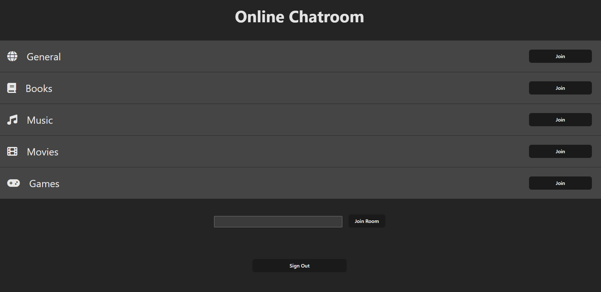
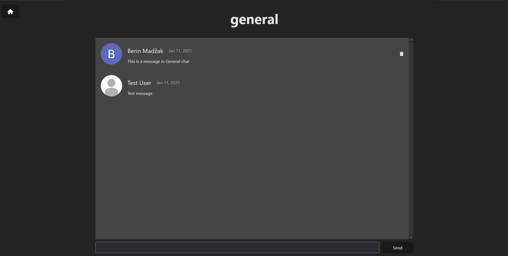

# Online Chatroom

You can try the project here: 
https://online-chatroom.vercel.app/

A Chatroom application built with **Vite** and **React**. The app allows the user to join various public chatrooms. The chatroom messages are stored using **Firebase**.

## Features
- **Google Login**: Users can log into the website using their Google account.
- **Predefined Chatrooms**: There are a few predefined chatrooms for common topics.
- **Custom Chatrooms**: Users can join any chatroom by name.
- **Live Chat**: Chatroom is updated in real time.
- **Responsive Design**: Adapts to various screen sizes.

## Tech Stack
- **Frontend**: React, Vite, CSS, JavaScript
- **API**: Firebase API
- **Deployment**: Vercel
- **Version Control**: Git, GitHub

## Screenshots




## Setup and Installation

### Prerequisites
- **Node.js**
- **npm**

### 1. Clone the Repository
```bash
git clone https://github.com/BerinMadzak/Online-Chatroom.git
cd Online-Chatroom
```

### 2. Install Dependencies
```bash
npm install
```

### 3. Run the development server
```bash
npm run dev
```

